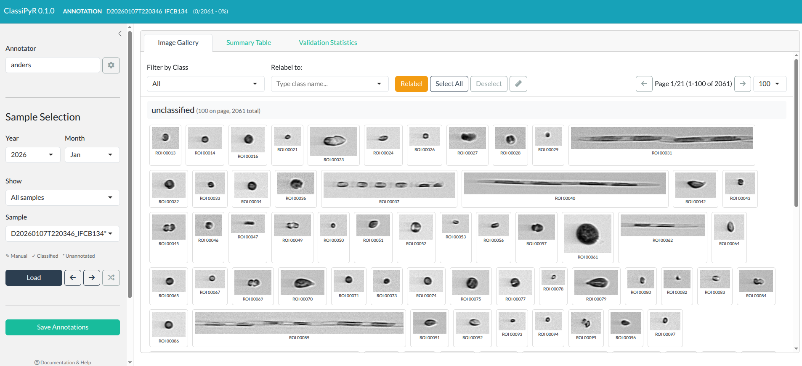
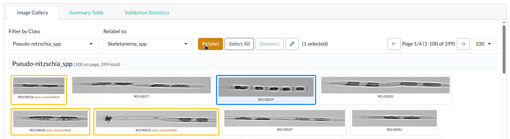
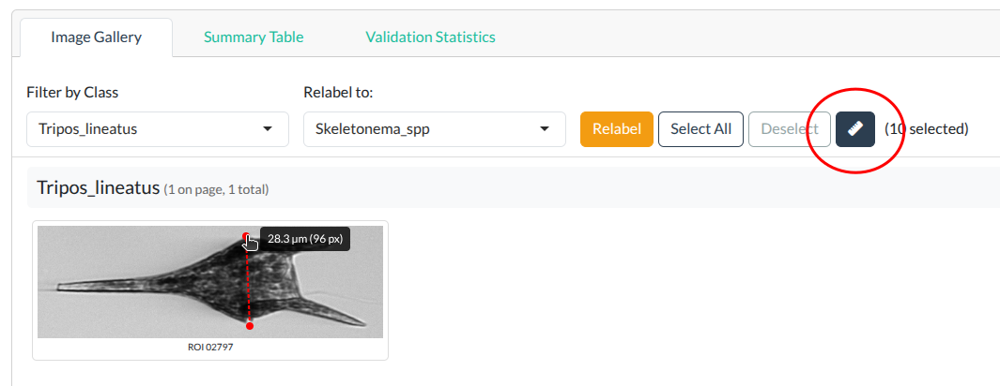

```{r, include = FALSE}
knitr::opts_chunk$set(
  collapse = TRUE,
  comment = "#>"
)
```

Complete documentation for all `ClassiPyR` features.

---

## Interface Overview

<a href="../reference/figures/interface-overview.png">

</a>
<p><em>ClassiPyR interface showing the title bar, sidebar, and main image gallery area. Click to enlarge.</em></p>

### Title Bar

- **App name and version**
- **Mode indicator**: Shows current sample and mode (Validation/Annotation)
  - Validation mode: Shows accuracy percentage
  - Annotation mode: Shows progress (X/Y classified)

### Sidebar

- **Annotator name**: Your name for statistics tracking
- **Settings**: Configure folders and options
- **Sample selection**: Year, month, status filters
- **Navigation**: Load, previous, next, random
- **Save button**: Manual save trigger

### Main Area (Tabs)

1. **Image Gallery**: View and annotate images
2. **Summary Table**: Class distribution statistics
3. **Validation Statistics**: Accuracy metrics and change log

---

## Validation vs Annotation Mode

### Validation Mode

- Activated when loading samples with existing auto-classifications
- Original classifications shown with confidence scores
- Statistics track how many you've changed
- Accuracy percentage calculated

### Annotation Mode

- Activated for samples without classifications
- All images start as "unclassified"
- Progress shows classified vs remaining
- Validation statistics tab shows annotation progress instead

### Samples with Both Modes

Some samples may have both manual annotations AND auto-classifications (e.g., you previously annotated a sample, then ran a classifier on it). For these samples:

- The sample dropdown shows ✎✓ indicator
- When loaded, you can switch between modes using the button in the header
- Each mode maintains its own state independently

---

## Working with Images

### Image Cards

Each image card displays:

- The plankton image
- ROI number
- Classification score (if available)
- Original class (if relabeled)

**Border colors:**

- Default (gray): Unchanged
- Yellow: Relabeled in this session
- Blue: Currently selected

<a href="../reference/figures/image-card-states.png">

</a>
<p><em>Image card border colors: gray (unchanged), yellow (relabeled), blue (selected). Click to enlarge.</em></p>

### Selecting Images

| Method | Action |
|--------|--------|
| Click | Toggle single image selection |
| Drag | Draw rectangle to select multiple |
| Select All | Select all images in current filter |
| Deselect | Clear all selections |

<a href="../reference/figures/drag-select.png">

</a>
<p><em>Drag-select: draw a rectangle to select multiple images at once. Click to enlarge.</em></p>

### Relabeling

1. Select target images
2. Choose new class in "Relabel to" dropdown
3. Click **Relabel**

The dropdown supports type-ahead search - just start typing the class name.

---

## Measuring Images

The measure tool allows you to measure distances in images.

### Using the Measure Tool

1. Click the **Measure** button (ruler icon) in the toolbar to activate measure mode
2. Click and drag on any image to draw a measurement line
3. The distance is displayed in both micrometers (µm) and pixels
4. Click elsewhere on the image to clear the measurement
5. Click the Measure button again to deactivate measure mode

<a href="../reference/figures/measure-tool.png">

</a>
<p><em>Measure tool showing distance in micrometers and pixels. Click to enlarge.</em></p>

### Configuring Scale

The default scale is 3.4 pixels per micrometer (standard for IFCB). To adjust:

1. Open **Settings** (gear icon)
2. Find **Pixels per Micrometer** field
3. Enter your instrument's calibration value
4. Click **Save Settings**

---

## Classification Sources

`ClassiPyR` supports multiple classification input formats.

### CSV Files

Standard classification CSV output. Required columns:

- `file_name`: Image filename (e.g., `D20230101T120000_IFCB134_00001.png`)
- `class_name`: Predicted class name

Optional columns:

- `score`: Classification confidence (0-1)

**Example CSV:**

```
file_name,class_name,score
D20230101T120000_IFCB134_00001.png,Diatom,0.95
D20230101T120000_IFCB134_00002.png,Ciliate,0.87
D20230101T120000_IFCB134_00003.png,Dinoflagellate,0.72
```

**Flexible column matching**: The app searches for columns containing "file" and "class" in their names, so variants like `filename`, `image_file`, `predicted_class`, or `class` will also work.

**Different CNN pipelines**: If your classifier produces different column names, rename them to `file_name` and `class_name`, or contact us to add support for your format.

Files are searched recursively in the Classification Folder.

### MATLAB Classifier Output

Files matching `*_class*.mat` pattern containing:

- `roinum`: ROI numbers
- `TBclass_above_threshold`: With threshold
- `TBclass`: Without threshold

**Threshold option**: Enable in Settings to include unclassified predictions below confidence threshold.

> **Note**: Reading MATLAB classifier output requires Python (via iRfcb).

### Existing Annotations

Previously saved annotations (in output folder) are automatically detected and can be resumed.

> **Note**: Reading existing .mat annotations requires Python (via iRfcb).

---

## Output Files

When you save, the app creates:

### Annotation MAT File

`output/[sample_name].mat`

MATLAB-compatible format with:

- `classlist`: ROI numbers and class indices
- Compatible with [ifcb-analysis](https://github.com/hsosik/ifcb-analysis) toolbox

> **Note**: Saving MAT files requires Python with scipy.

### Statistics Files

`output/validation_statistics/[sample_name]_validation_stats.csv`

- Summary: total, correct, incorrect, accuracy

`output/validation_statistics/[sample_name]_validation_detailed.csv`

- Per-image: original class, validated class, correct flag

### Organized PNGs

`png_output/[class_name]/[image_files]`

Images organized into class folders for training CNN models or other classifiers.

---

## Settings Reference

### Folder Paths

| Setting | Description |
|---------|-------------|
| Classification Folder | Source of CSV/MAT classifications |
| ROI Data Folder | IFCB raw files (ROI/ADC/HDR) |
| Output Folder | Where MAT and CSV output goes |
| PNG Output Folder | Where organized images go |

### Python Configuration

| Setting | Description |
|---------|-------------|
| Python Virtual Environment Path | Path to venv with scipy installed |

The venv path can also be specified when launching the app:

```{r, eval = FALSE}
run_app(venv_path = "/path/to/your/venv")
```

### Classifier Options

**Apply classification threshold**: When loading MATLAB classifier output, use `TBclass_above_threshold` (checked) or `TBclass` (unchecked).

---

## Statistics and Reporting

### Summary Table Tab

Shows class distribution:

- Class name
- Image count
- Average/min/max confidence scores

### Validation Statistics Tab

**Classification Performance**:

- Total images
- Correct/incorrect counts
- Overall accuracy
- Per-class breakdown

**Changes Made**:

- Table of all relabeling actions
- Original class → New class

---

## Session Cache

The app maintains a session cache:

- Switching samples saves work automatically
- Returning to a sample restores your changes
- Cache persists until you close the app

**Note**: Always click Save before closing for permanent storage.

---

## Settings Persistence

`ClassiPyR` stores your settings in a configuration file that follows R standards:

- **Linux**: `~/.local/share/ClassiPyR/settings.json`
- **macOS**: `~/Library/Application Support/ClassiPyR/settings.json`
- **Windows**: `%LOCALAPPDATA%/ClassiPyR/settings.json`

Settings are loaded automatically when you start the app, so your folder paths, class list location, and Python venv path are remembered between sessions. Settings can be reset by specifying `run_app(reset_settings = TRUE)`.

---

## Dependencies

`ClassiPyR` relies on **[iRfcb](https://github.com/EuropeanIFCBGroup/iRfcb)** for all IFCB data operations:

- Extracting images from ROI files
- Reading ADC metadata (dimensions, timestamps)
- Reading and writing MATLAB .mat files
- Class list handling

iRfcb is installed automatically as a dependency when you install `ClassiPyR`.
